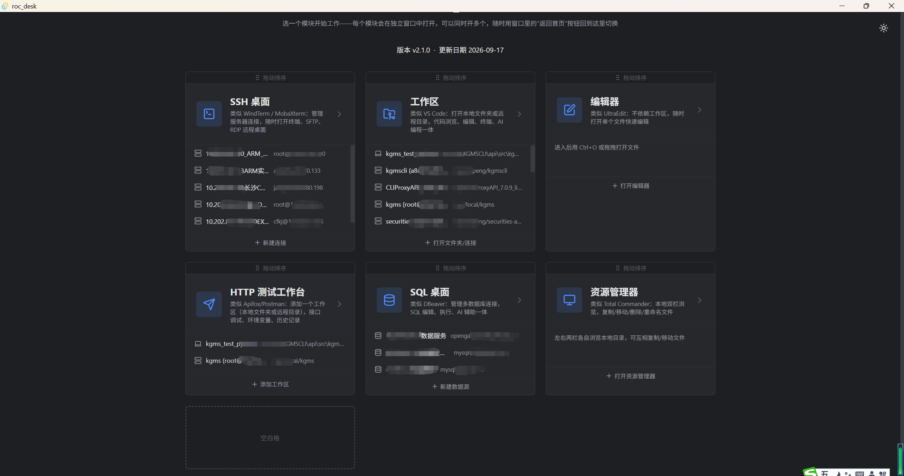
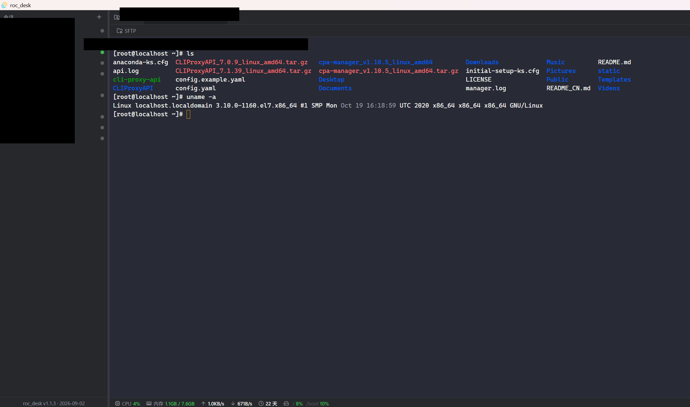
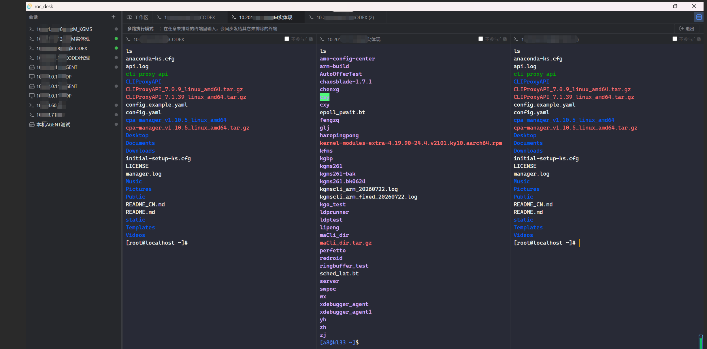
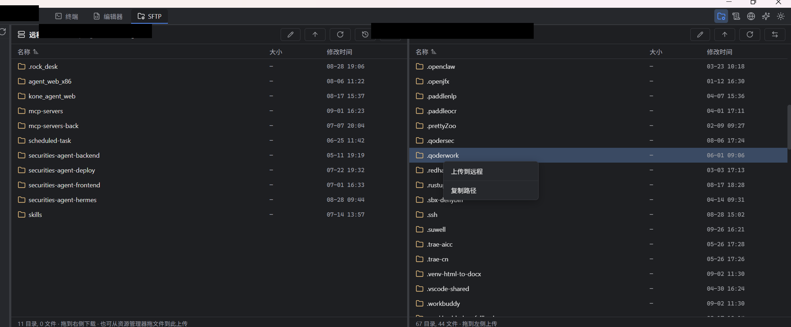
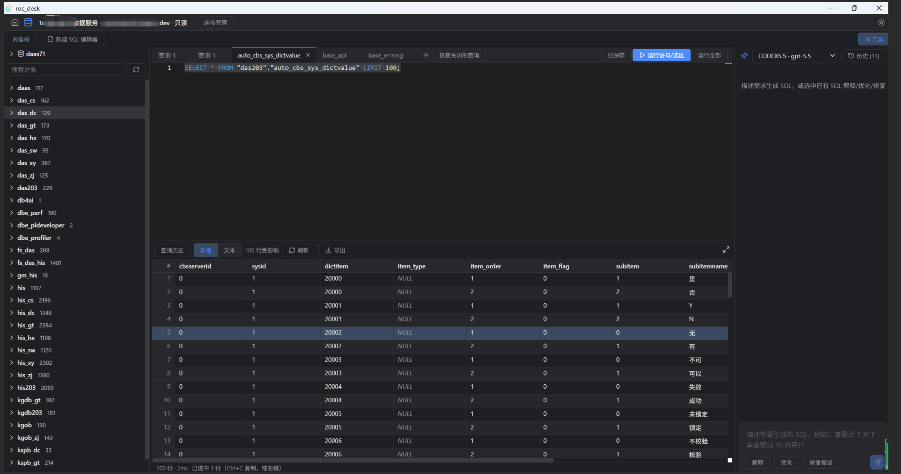
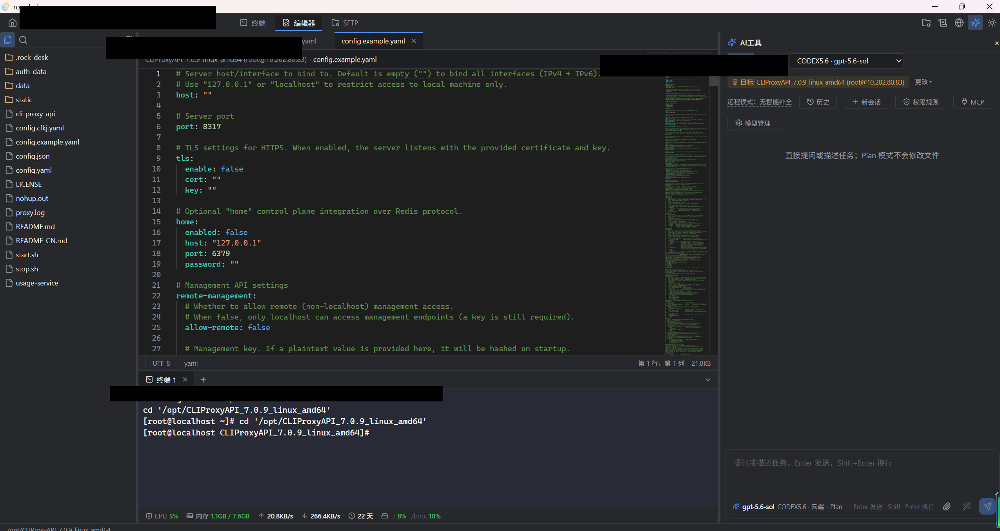
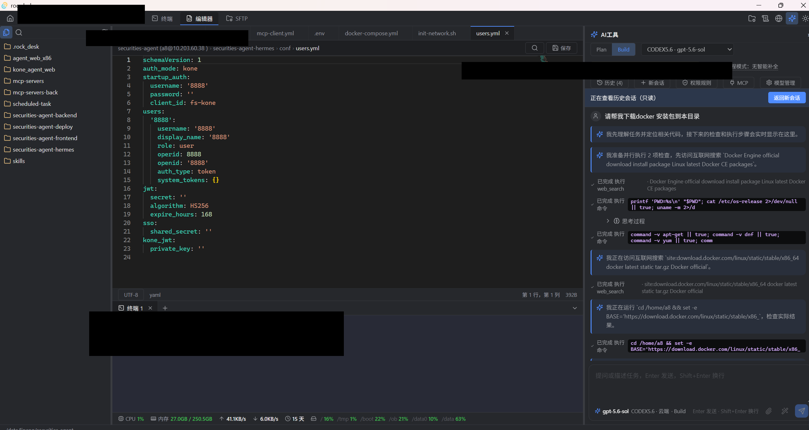

# roc_desk：一个 Rust 写的"IT 工作者一体化桌面"，SSH 终端、SFTP、日志搜索、SQL、HTTP 调试、AI 编程助手，六个模块装进一个免安装的单文件 exe

> **项目地址：[github.com/swimhigh/roc_desk](https://github.com/swimhigh/roc_desk) —— 觉得有用的话，点个 Star 是对开源作者最大的支持 ⭐**

> 运维/开发同学的日常，大概率是在 6 个窗口之间反复横跳：WindTerm 敲命令、FileZilla 传文件、VS Code 改配置、DBeaver 查数据库、Postman 调接口、浏览器开着 AI 聊天窗口问"这段日志什么意思"。roc_desk 想做的事情很简单——**把这些工具合成为一个应用**。

## 一、为什么又造了一个轮子？

先说痛点。一次典型的线上排障流程是这样的：

1. SSH 连上服务器，`tail -f` 看日志；
2. 发现报错，`grep` 翻历史日志定位时间点；
3. 疑似配置问题，SFTP 把配置文件拉到本地；
4. 用编辑器打开——结果发现是 GBK 编码，乱码；
5. 改完传回去，重启服务，再回终端看日志；
6. 中间还查了一次数据库，问了一次 AI。

这六步里每一步都在切换工具窗口、切换上下文。WindTerm/FinalShell + FileZilla + 编辑器 + DBeaver + Postman + AI 聊天页——工具是齐的，但**流程是断的**：日志里的一段文本要复制到 AI 对话框、配置文件的路径要在 SFTP 里重新导航一遍、改完接口要在 Postman 里重配一遍环境变量。

roc_desk 的答案是把这条链路焊在一起：**基于 Tauri 2.0（Rust 后端 + React/TypeScript 前端）的单体桌面应用**，UI 交互范式对齐 VS Code——左侧文件树、顶部 Tab 栏、底部停靠终端、右侧停靠 AI 工具栏，学过 VS Code 就零学习成本。

## 二、六个工作模块：首页是个"仪表盘"

roc_desk 不是一个"大而全的巨型窗口"，首页是一个分区仪表盘，六种工作模式各占一个入口，**点开任意模块都会另起一个独立进程和独立窗口**，可以同时开多个、同一模块也能开多个：

| 模块 | 定位 | 对标 |
|---|---|---|
| **SSH 桌面** | 会话树 + SSH 终端 + SFTP + RDP 远程桌面 | WindTerm / MobaXterm |
| **工作区** | Explorer + 编辑器 + 终端 + 日志搜索 + AI 工具 | VS Code（远程开发形态） |
| **编辑器** | 不依赖工作区的多标签文本编辑器 | UltraEdit |
| **HTTP 测试工作台** | 接口调试、集合管理、环境变量、请求历史 | Apifox / Postman |
| **SQL 桌面** | 多数据库连接管理、SQL 编辑执行、AI 辅助 | DBeaver |
| **资源管理器** | 双栏文件管理，本地/SSH 混合标签 | Total Commander |

模块分区的顺序支持拖拽自定义，还可以增减空白格调整布局密度。多进程架构带来一个实际好处：**崩溃隔离**。一个工作区窗口崩了，不影响首页和其他窗口；两个工作区窗口之间，终端、编辑器标签状态完全独立。同时所有窗口共享同一份数据目录（连接档案、工作区列表），拷贝整个目录就是完整的绿色便携版。



## 三、核心功能逐个看

### 3.1 工作区：远程文件像本地文件一样编辑

工作区是一个"本地目录"或"远程主机 + 目录"的绑定。打开远程工作区后，点文件树里的远程文件，内容读进本地内存缓冲区，**所有编辑操作都在本地完成，零网络往返，输入手感与编辑本地文件完全一致**，`Ctrl+S` 时才整体写回。

几个容易踩坑的细节都做了处理：

- **编码自动探测**：按 BOM → UTF-8 → GBK 顺序探测，Windows 上大量遗留 `.ini`/`.h` 文件是 GBK，不会再"打不开"或乱码；状态栏可手动切换编码，支持"重新打开为/保存为"指定编码（UTF-8/GBK/UTF-16 等）；
- **保存冲突检测**：保存前比对远程文件的 mtime，编辑期间被别人改过就弹冲突对话框，不静默覆盖；
- **断线容忍**：编辑中 SSH 断开不影响本地缓冲区，重连后继续保存；
- **文件对比**：右键两个文件即可用 Monaco 并排 Diff 视图对比。

### 3.2 终端：VS Code 式底部停靠 + 多会话

终端停靠在编辑器下方（可折叠、可拖高度），本地终端（真 PTY）和远程 SSH 终端共用一套渲染逻辑，支持多 Tab，默认进入工作区目录。

两个值得说的细节：

- **连接多路复用**：同一主机的多个终端 Tab、SFTP、日志搜索复用**同一条 SSH 物理连接**，不是每个 Tab 各自握手一次；
- **多终端同步操作（MultiExec）**：开启后在一个终端里敲的命令会广播到其它所有终端——批量给 10 台机器执行同一个操作时不用逐个粘贴。





### 3.3 SFTP：双栏拖拽传输

左侧远程、右侧本地的双栏浏览器，**任意方向拖拽即上传/下载**（含整个目录递归传输），也支持右键菜单对称操作。本地侧会记住这个工作区上次停留的目录，远程侧默认就是工作区根目录。跨目录自由浏览不受工作区边界限制——排障时顺手看一眼 `/etc/nginx` 是常态需求。



### 3.4 日志搜索：grep/cat/sed 的可视化替代

这是整个项目最有差异化的功能，双引擎设计：

- **实时搜索**：通过 SSH 在远程主机上直接跑 `rg`（没装自动降级 `grep -E`），享受完整的 Linux 正则生态，且**文件内容不离开远程主机**；目录输入框带 Tab 补全式自动提示，还内置了一批排障场景的正则示例（IP 匹配、耗时字段、多选一……）；
- **本地索引搜索**：把远程日志导入本地 SQLite FTS5 全文索引，适合频繁搜索、历史日志分析。在文件树或 SFTP 里右键任意文本文件即可"导入到本地搜索引擎"。

配合编辑器对 `.log` 文件的**日志语法高亮**（时间戳、级别关键字按语义着色，ERROR 一眼可见），"翻日志"这件事终于不用在纯黑白文本里进行了。

### 3.5 SQL 工作桌面：DBeaver 式数据库客户端

管理多个数据库连接（openGauss/MySQL 等），对象树浏览、多标签 SQL 编辑与执行、查询历史。杀手锏是 **AI 辅助**：选中一段看不懂的 SQL，AI 可以解释、优化、修复，甚至根据自然语言描述直接生成 SQL。



### 3.6 HTTP 测试工作台：Apifox/Postman 式接口调试

第六个工作模块。聪明的复用点在于：**它不新造一套"项目"概念，而是直接复用工作区体系**——同一个本地目录或同一个 SSH/Agent 远程目录，既可以用"工作区"模块写代码，也可以用"HTTP 测试工作台"模块调试这个项目的接口，两者是同一份记录的两种打开方式。

功能形态对齐主流 API 工具：

- **集合 + 文件夹**组织请求树，左侧管理，多标签页编辑请求；
- 请求编辑区多 Tab：**Params / Headers / Body（JSON / Raw / x-www-form-urlencoded / form-data）/ Auth**；
- **环境变量**：全局变量 + 多环境（开发/测试/生产），`{{var}}` 插值，一键切换环境重放同一个请求；
- **curl 一键导入**——从文档或终端里复制一条 `curl` 命令直接变成可保存的请求；
- **请求历史**：每次发送自动留痕，可回看详情、可清理。

对于"改完代码立刻要自测一遍接口"的后端同学，从此不用在 IDE 和 Postman 之间来回切——调试和代码在同一个应用里，环境变量跟着项目走。

### 3.7 AI 工具：不是"挂个聊天框"，而是一个 Agent

AI 工具停靠在工作区右侧（宽度可拖动），统一承载问答和编程，支持任意 OpenAI 兼容 API（DeepSeek、豆包、通义千问、本地 Ollama……），SSE 流式输出。编程能力采用 **Plan / Build 双模式**（OpenCode 风格）：

- **Plan 模式**：只读分析——读代码、搜文件、给方案，一个字节都不改；
- **Build 模式**：真动手——读/写/编辑文件、执行命令、联网搜索，**每次修改生成 Diff，你逐条 Accept/Reject，按轮次批量撤销**（不依赖 git）。

工具调用过程完全透明：时间线里能看到模型每一步在读哪个文件、搜什么关键词、执行什么命令，中间的思考说明文字也会展示，不会"黑盒跑半天突然给你一个结果"。

安全机制是认真做的，不是摆设：

- **高危命令硬拦截**：`rm -rf /`、`mkfs`、fork bomb 之类破坏性命令直接拒绝，没有绕过选项，有对抗测试覆盖（防止用 `&&` 拼接收绕过）；
- **普通命令逐条确认 + 只读白名单**：`ls`/`cat`/`git status` 可选自动放行；
- **审计日志**：所有命令尝试（含被拦截的）落 SQLite，可导出；
- **数据出境脱敏**：发给云端 AI 前自动遮蔽 AWS Key、PEM 私钥、`password=xxx` 这类高置信度敏感模式；本地 Ollama 不脱敏。





### 3.8 应用内网页浏览

主窗口内嵌多标签页浏览器（原生子 WebView，与主应用 IPC 上下文完全隔离——第三方网页拿不到任何本地能力），浏览过的页面有历史记录，支持 Ctrl+滚轮缩放。查文档不用再切出去开浏览器。

## 四、技术选型：为什么是 Tauri 2.0 + Rust

先坦白体积：`roc_desk.exe` 目前约 **40MB**——Rust 后端（SSH/SFTP/SQLite/HTTP/AI 全部 domain 逻辑）加上完整前端静态资源全部嵌在**一个文件**里。作为对比：

| 对比维度 | Electron 应用 | roc_desk |
|---|---|---|
| 分发形态 | 安装包 + Chromium 运行时 | **单文件 exe，双击即用** |
| 典型体积 | 150MB+（装完更胖） | ~40MB |
| 后端语言 | Node.js | **Rust** |
| WebView | 内置 Chromium（多一份） | 系统 WebView2 |
| 数据目录 | 散落在 AppData | 与 exe 同级，整个目录拷走就是便携版 |

不需要安装 Node/Rust 环境，没有运行时依赖；数据（SQLite、日志、配置）都在 exe 旁边的 `.rock_desk/` 目录里，备份和迁移就是复制粘贴。核心依赖全部来自成熟开源组件：

- **SSH/SFTP**：`russh` + `russh-sftp`（纯 Rust 实现，不是 libssh2 绑定）
- **终端**：`xterm.js`；**编辑器**：Monaco Editor
- **日志索引**：SQLite FTS5；**HTTP/AI**：`reqwest`
- **异步运行时**：`tokio`；**凭据**：`keyring`（系统密钥链）

安全设计上有个容易忽略的细节值得单独说：**主机指纹校验（TOFU）**。首次连接弹窗展示指纹，用户显式确认后才写入 known_hosts；指纹变化（可能中间人攻击）时红色告警、默认拒绝。很多自研 SSH 工具为了省事是无条件信任服务器公钥的。

## 五、快速上手

```bash
# 前置：Rust (rustup) + Node.js 18+；Win10/11 自带 WebView2
git clone https://github.com/swimhigh/roc_desk.git
cd roc_desk
npm install --prefix src-web
npm run tauri:dev      # 开发模式，热重载

npm run tauri:build    # 产出 build/release/roc_desk.exe + MSI/NSIS 安装包
```

**许可证**：MIT + Commons Clause——可以自由使用、修改、分发（包括商业环境内部使用），唯一限制是不能把本软件本身直接拿去卖钱或作为收费服务对外提供。

## 六、路线图（诚实版）

按项目一贯的"状态诚实"原则，未完成的就说未完成（当前版本 v2.1.0，2026-09-17）：

- ✅ 已实现：六个工作模块（SSH 桌面 / 工作区 / 编辑器 / SQL 桌面 / HTTP 测试工作台 / 资源管理器）+ 网页浏览 + 多进程多窗口架构 + Windows 单文件打包
- 🚧 进行中：Windows 远程 Agent（`roc_desk_agent.exe`，为没有 OpenSSH 的 Windows 服务器提供原生远程工作区支持）
- 📋 规划中：Lua 插件引擎

## 七、写在最后

roc_desk 不是要替代 VS Code，也不是要替代 DBeaver——它是为"**每天在终端、文件、日志、数据库、AI 之间来回切换的人**"做的一体化工作台。所有核心场景（远程文件编辑、日志检索、AI 改代码）都围绕"同一个排障流程的连续步骤"设计，减少的不是功能，是**切换成本**。

如果你也是那个开了 5 个窗口的运维/开发，欢迎试用、提 Issue、提需求——这个项目的需求文档里每一条都来自真实使用反馈，你的排障痛点可能就是下一个版本的功能。

---

## 项目地址

# ⭐ [github.com/swimhigh/roc_desk](https://github.com/swimhigh/roc_desk) ⭐

**欢迎 Star / Issue / PR**——这个项目的需求文档里每一条都来自真实使用反馈，你的排障痛点可能就是下一个版本的功能。
